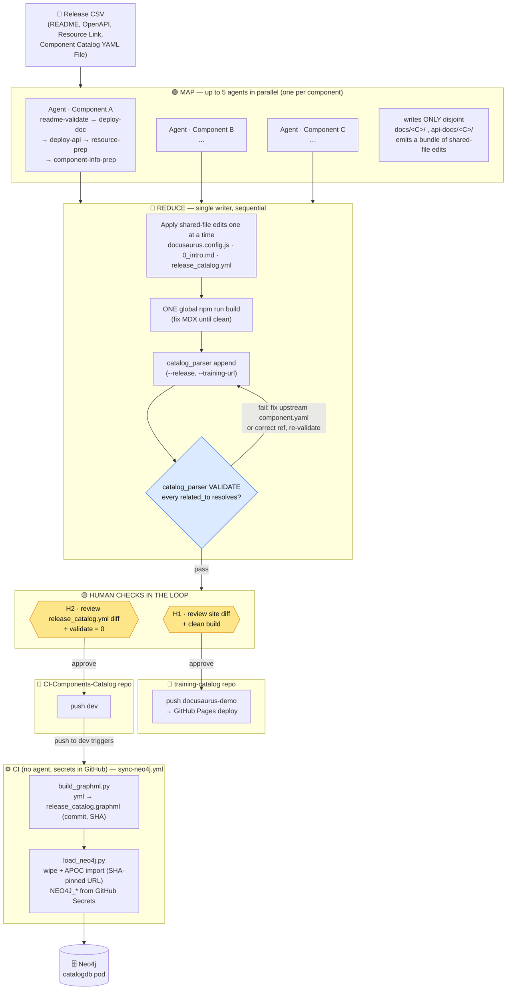

# ICICLE Release — System Architecture

Multi-agent, agentic release system with human checks in the loop. It publishes (or
updates) a batch of ICICLE components into **two repos** — the `training-catalog`
Docusaurus site and the external `CI-Components-Catalog` — then lets CI sync the
component graph into Neo4j. The agent never handles secrets.

## Design principle

Per-component work is parallel **only where it writes to disjoint paths**
(`docs/<C>/`, `api-docs/<C>/`). Everything converges on **shared files**
(`docusaurus.config.js`, `other_resources/0_intro.md`, `release_catalog.yml`), a
**single global build**, and **gated pushes** — so the shape is **fan-out (MAP) →
gather (REDUCE) → human-gated push**, not N independent pipelines.



## Human checkpoints

| Gate | When | What the human does |
|------|------|---------------------|
| **H1** | after the global build | Review the site `git diff` + confirm the build is clean → approve push to `docusaurus-demo` (live site deploy) |
| **H2** | after `catalog_parser validate` passes | Review the `release_catalog.yml` diff → approve `git push origin dev` |
| **(implicit)** | any ambiguity | Unresolved `validate`, uncertain versions, or dependency choices pause for the human |

The **`validate`** step is the automated guard between REDUCE and the human gate: a
`related_to` that doesn't resolve would crash `build_graphml.py` (`KeyError`) in CI, so
the release stops locally until it's fixed.

## Why not 10 fully-independent pipelines

Two agents writing `docusaurus.config.js` or `release_catalog.yml` at the same time
corrupt the file, and `hasDependentComponents` can point at another component in the
**same** batch — so the shared writes, the single build, and the dependency validation
must be one serial REDUCE. The cap is **5** MAP agents; for small batches, run MAP
inline (the bottleneck is the global build + human review, which don't parallelize).

## Secrets boundary

The agent leaves `release_catalog.yml` valid and pushed; **CI does the graph + DB
work** with `NEO4J_URI/USER/PASSWORD` and `GRAPHML_URL` from GitHub Secrets. The agent
never reads a `.env` or password file. Manual re-ingest = run `scripts/load_neo4j.py`
locally with a `.env` (agent must not read it).
```
