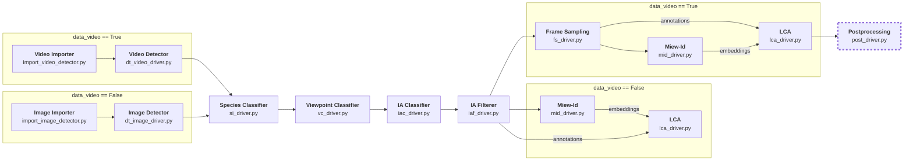

---
tags:
  - Software
  - Animal Ecology
---

# Explanation

## Definitions of Key Terms and Concepts

* **Animal Re-Identification (re-id)**: The process of determining if an animal has been seen before by matching it against a database of images with known identity labels. The paper addresses this problem in the context of long video sequences.
* **Multiview Spatio-Temporal Track Clustering**: A novel framework introduced for animal re-identification. It works by clustering tracked animal detections from different viewpoints (multiview) and across time (spatio-temporal) to correctly identify individuals.
* **Identifiable Annotation (IA)**: An annotation, or detected animal image, that contains sufficient distinguishing information for reliable individual identification. For Grévy's zebras, an IA must show both the hip and chevron patterns on either the left or right side.
* **Human-in-the-loop**: The involvement of human decisions to confirm animal identities when the automated system is uncertain or to correct algorithmic errors.

## Repository File Structure

The following is a simplified hierarchy of the file structure using in this repository.

```
VAREID
├── algo
|   ├── detection/
|   ├── frame_sampling/
|   ├── ia_classification/
|   ├── import/
|   ├── lca/
|   ├── miew_id/
|   ├── postprocessing/
|   ├── species_identification/
|   └── viewpoint_classification/
├── drivers/
├── models/
├── tools/
├── libraries
|   ├── db/
|   ├── io/
|   ├── logging/
|   ├── ui/
|   └── constants.py
├──   config.yaml
├──   environment.yaml
└──   snakefile.smk
```

The repository can generally be split into four groups of code:

#### Algorithm Components
Algorithm components are the invidual steps of the pipeline, such as detection or species classification. They are contained in `VAREID/algo/[component_name]/` in separate directories. In some specific cases, two components may share the same directory, such as `video_detector.py` and `image_detector.py`. Their only dependency (within this repository) would be library functions. Every component here should have an executable script to run that step of the pipeline.

For more information on each algorithm component, please view the **README** files in each of their corresponding directories. Their arguments are also documented via the **argparse** python library.

#### Pipeline (Snakemake)
The pipeline's workflow is built using **Snakemake**. The workflow is defined in `snakefile.smk`, via executions to **driver scripts**.

The snakefile reads in a configfile structured like `config.yaml`. To build a configfile, please follow the notations found in the example `config.yaml`.

#### Driver Scripts
Driver scripts serve as connectors between the pipeline and the algorithm components. They handle determining conditional arguments passed to algorithm components (such as flags or variations in parameters based on image vs. video mode), setting up logging, building the command, and executing the algorithm component. Every algorithm component must have a driver script associated with it.

#### Libraries
The libraries contain all util functions used throughout the pipeline. These libraries range from database operations (e.g. image tables and directories), IO (image/video importing, loading/saving data, etc.), logging, UI, and more.

### Other important files and directories...
In addition to the above structure, there's a few more important directories to note. 

#### Models
All models are stored in the `VAREID/models/` directory. This primarily includes the `.pth` files for the viewpoint classifier and IA classifier models. It also includes the verifiers probabilities used by LCA, but this is being phased out.

#### Tools
This directory contains some prototype tools that provide convenience and extra functionality to users. `visualize.py` is a script that draws and labels specific annotations. `extrapolate_ggr_gps.py` extrapolates GPS data for images missing it, which is specific functionality for images taken by the same camera with timestamp data.

#### environment.yaml
This is the file defining the python environemnt requirements for this repository. Use this file with a package manager like **conda** to build an environment. More on this in the **How-To** section.

## Pipeline Workflow

The following is a flowchart describing the workflow of the pipeline, along with the associated driver script for each stage.



One important detail to note immediately is that postprocessing is external from the pipeline's workflow! This section, as will be explained below, requires human interaction and thus is not automatically ran by the pipeline. It is run separately and for video data only.

### Input Format
The pipeline's input is any recursive directory structure. For image mode, the pipeline will read in ALL images within the provided directory and its child directories. For video mode, we will read all videos. **When running the pipeline on videos, each video must have a matching (same file name) SRT file located in the same directory.** In other words, the absolute paths to the video and SRT file only differ by their file extension. Each entry of the SRT file should be formatted like the following:

```
1
00:00:00,000 --> 00:00:00,033
<font size="36">SrtCnt : 1, DiffTime : 33ms
2023-01-19 11:48:31,795,565
[iso : 100] [shutter : 1/2000.0] [fnum : 280] [ev : 0] [ct : 4823] [color_md : default] [focal_len : 224] [latitude: 0.386694] [longitude: 36.893198] [altitude: 23.900000] 
</font>
```

### Pipeline Stages & Algorithms

#### 1. Import
Importing's main goal is generating the `image_data.json` or `video_data.json` file describing each image (or frame for videos) in terms of metadata, including the absolute path to the image. For videos, this also includes splitting and saving the video into frames as well as parsing an SRT file to assign timestamps to frames.

#### 2. Detection
Detection uses YOLO to create detections for all images in the json files from above. Video detection also generates tracking IDs for each detection. The detections are saved as annotations.

#### 3. Species Classification
The species of each annotation is generated via Bioclip. For now, this includes Grevys Zebras, Plains Zebras, or neither.

#### 4. Viewpoint Classification
The viewpoint of each annotation is generated. The viewpoint is a combination of the following classifiers: `[up, front, back, left, right]`.

#### 5. Identifiable Annotation (IA) Classification
Each annotation is assessed for its quality and ability to be identified. They are assigned a score and assigned a boolean for whether they are identifiable or not based on a threshold.

#### 6. Identifiable Annotation (IA) Filtering
This step filters out all annotations that were marked as not identifiable and simplifies the viewpoint to `left` or `right`.

#### 7. *Frame Sampling*
This is a *video only* process. This step further filters annotations by performing non-maximum supression over sets of consecutive tracking ids, maximizing the score from IA classification.

#### 8. Miew-Id
This step generates embeddings for all remaining annotations.

#### 9. Local Clusters and Alternatives (LCA) Algorithm
This step clusters the annotations by their embeddings and assigns cluster ids.

#### 10. *Post-processing and ID Assignment*
Applies final consistency checks, resolves cluster overlaps, handles manual verification when needed, assigns final unique IDs, and integrates non-identifiable annotations via tracking links.
